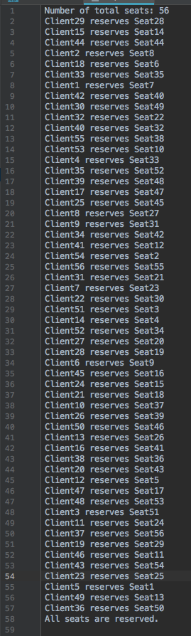

# CMPE322-Flight-Reservation-System-Simulator
#### Simulating a Flight Reservation System with multiple threaded programming

## Design and Methodology

### Threads

* Main Thread
    * Responsible for reading `<number_of_clients` argument,
    * Initializing globals, reading empty seats,
    * Creating `<number_of_clients` server and client thread pairs.
    * Waiting for all the client & server threads to finish
    
* Client Thread
    * Cannot access server data, directly. Instead makes requests to its server thread to get data.
    1. Picks a number of milliseconds between 50 and 200 and waits for that long upon arrival.
    2. Requests its server thread pair for the current seat list reservation statuses.
    3. Picks a random seat from the empty seats in the given list.
    4. Requests its server thread pair to reserve that seat, and if it's not available, the new seat list reservation statuses.
    5. If the server replied with a seat list, indicating the reservation failed, goes back to step 3, otherwise end.
    
* Server Thread
    * Responsible for handling data: 
        * Reserving a seat on the real server data, 
        * Making readable copies to send to its client pair, 
        * Disposing these copies when they're not used anymore (client responded to that list)
    * Tries to reserve requested seats while taking care not to interfere with another server thread's request.
    * Upon successful reservation, prints out that the client reserved that seat.
    1. Waits for a request from the client.
    2. Reply the client with a response that includes the current seat list reservation statuses.
    3. Wait for the client to request reservation of a seatID.
    4. Tries to reserve that seat, and if it's already reserved, go back to step 2. Otherwise, reply with a `NULL` response indicating a successfull reservation.
     
### Message Protocol
There's a message lock for each client and server which are initially locked.

* Whenever, one of them gets unlocked, that means it received a new message from its paired server/client thread.
* Whenever, one wants to access the message sent to it (including waiting for that message if it's not ready yet) it should simply try to lock(wait) its message lock.

A server can send the following messages to its client:
* `NULL`, indicating a successful reservation.
* `seatList` of type `*seat_list`, that lists all the current reservation statuses of the seats. Indicates that either the requested reservation failed or no seat was requested to be reserved.

A client can send the following messages to its server:
* `NULL` indicating a request to the list of reservation statuses without trying to reserve a seat.
* `seatID` of type `*int`, that points to a seat's id that the client wishes to reserve.
 
### Seat List Type `seat_list`
* Includes an array of reservation statuses of seats (1 for reserved, 0 for empty, not indicating the reserver id for privacy reasons)
* Includes the total number of seats (the effective length of that array)
* Includes the number of references to that list, meaning in how many scopes (global and server thread scopes) is this list being used. Used to determine when the list can be deleted from memory.
* Includes a mutex lock to change that number of references
* Used for sending the current seat reservation statuses from a server to a client while not preventing reservations to real seats. 
* What's more, a global `currentSeatList` is kept and updated by a new copy on every new reservation, so that server threads can instantly return that list when requested. (Of course, this technique introduces some more mutex locks which can be viewed in the program code and comments) 


## How to Compile
```
gcc project2.c
```
(doing so would create an executable called `a.out`)

or

```
gcc project2.c -o <program_name>
```
(doing so would create an executable called `program_name`)

or
```
make
```
(doing so would execute `gcc project2.c -o flightReservationSystemSimulator` behind the scenes, creating you an executable called `flightReservationSystemSimulator`)

## How to Run

```
./flightReservationSystemSimulator <number_of_clients>
```
(number of clients must be an integer between 50 and 100 where both are inclusive)

Doing so would simulate a flight reservation system as explained in the 
[Project Description](./Project2.pdf) with `number_of_clients` clients and the same number of seats outputting the results into `output.txt` file. 


* Also, the output should consist of `<number_of_clients> + 2` lines where
* The first line is `Number of total seats: <number_of_clients>`,
* The lines `2` to `<number_of_clients> + 1` are which client reserved which seat
* The last line (`<number_of_clients> + 2`th one) is `All seats are reserved.`
* The output ends with an end line as is usual and expected in linux environments.
(`<number_of_endlines` = `<number_of_lines>`  = `<number_of_clients> + 2`)

   

### Example:

Running,
```
./flightReservationSystemSimulation 56
```
creates the below `output.txt` file:




